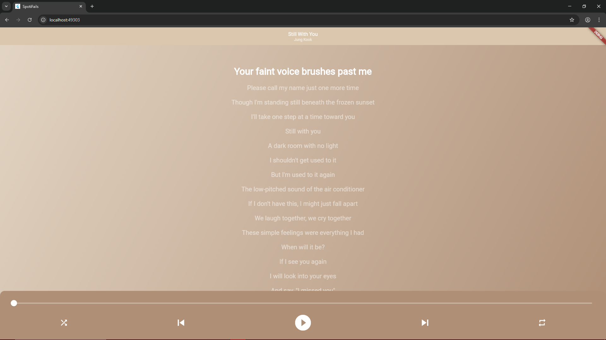

# 🎛️ ۰ Spotifails
C'est une sample flutter qui se base sur le système et l'interface de la fenêtre de Lyrics Spotify.
 
Intégrable dans vos projets flutter, ce sample peut servir si vous souhaitez créer votre propre applications musical alternative a Spotify, Deezer, Amerigo ou Apple Music.
Bien sûr il faut ajuster le code à vos propre ambitions.

# Plateforme Responsive
Je n'ai pas eu à vraiment travaillé la responsive car la framework Flutter s'en charge elle même.

## 🖥️ ۰ Desktop :

## 📱 ۰ Phone

